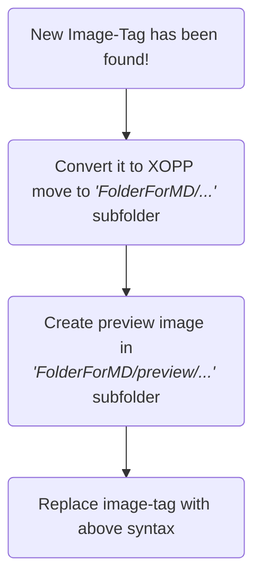

- converts images in the form

  ``

  or

  ``

  to

  ```html
[Open Image]({relative_md_file_dir}/{filename}.xopp)

```


```rust
Dir
│   md_file.md 
│
└───md_file (folder)
    │   xournal_file.xopp // Is being edited by the user
    │
    └───preview
            preview_image.png // is displayed in the md file that the xopp is actually visible in the MD-file
```



